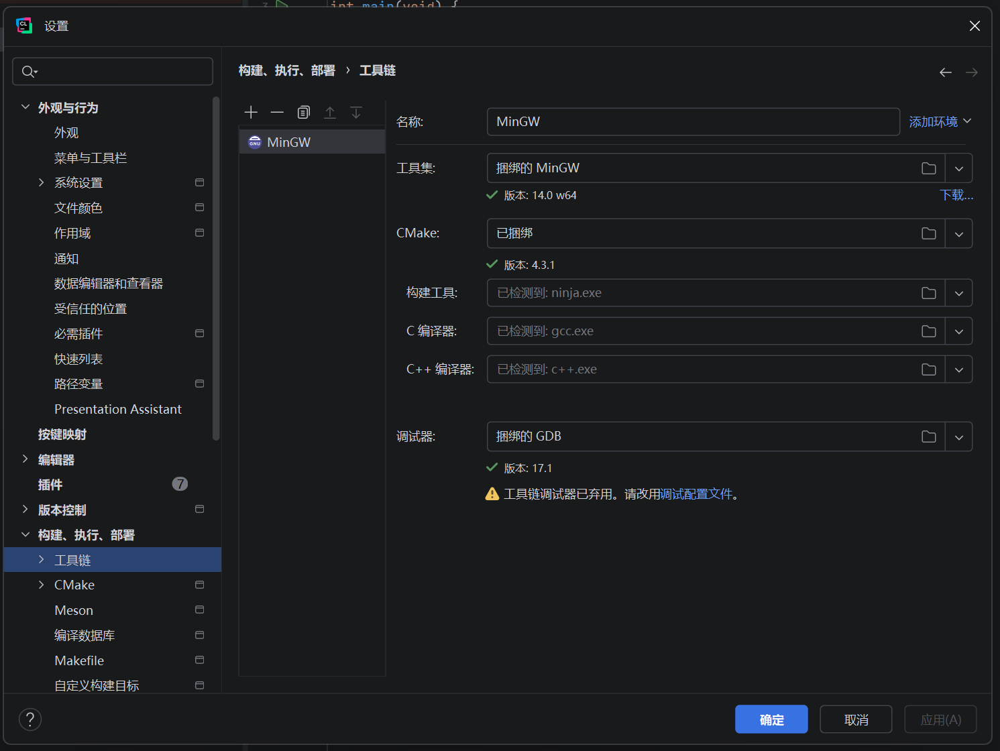
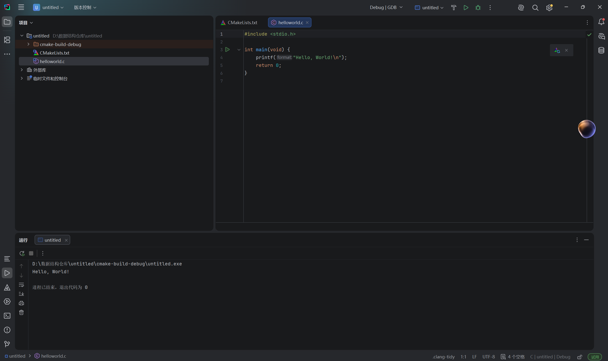

# Lab1：安装 CLion 并运行 C 语言 Hello World

> **作业目标**：完成 CLion、C 编译工具链和第一个 C 项目的安装配置，能够在 CLion 中编译并运行 C 程序。
>
> **提交前请先阅读**：本次正式作业只允许提交本文末尾列出的 4 个文件。此前用于练习 GitHub 提交的 `demo.c` 不属于正式作业，必须从自己的 `Lab1` 文件夹中移除。练习 PR 已统一关闭，完成正式作业后必须重新发起 PR，不得重新打开旧练习 PR。

---

## 一、安装 CLion

### 1.1 下载与授权

1. 打开 [CLion 官方安装说明](https://www.jetbrains.com/help/clion/installation-guide.html)。
2. 推荐先安装 [JetBrains Toolbox App](https://www.jetbrains.com/toolbox-app/)，再通过 Toolbox 安装 CLion，后续更新和卸载更方便。
3. 首次启动时按照界面提示登录 JetBrains 账号。
4. 本课程属于学习用途，可以按照 JetBrains 当前页面选择个人非商业授权；如果学校已提供教育授权，也可以使用学校授权。

> 不要从第三方网盘或不明网站下载安装包。截图中不要展示账号密码、授权码、邮箱等隐私信息。

### 1.2 确认 C 工具链

本课程主要使用 Windows。CLion 的 Windows 版本已经提供可直接使用的 Bundled MinGW 工具链，通常不需要另行安装 MinGW。

首次创建项目后，打开：

```text
File → Settings → Build, Execution, Deployment → Toolchains
```

确认以下项目均已被 CLion 正确识别，没有红色错误提示：

- Toolset：Bundled MinGW
- CMake
- Build Tool
- C Compiler
- Debugger

如果使用 macOS 或 Linux，请根据 CLion 官方安装说明准备 Clang 或 GCC，并在 Toolchains 页面确认识别正常。

打开 Toolchains 设置页面并提交截图，截图中必须清晰显示：

- CLion 的 Toolchains 设置页面；
- 当前使用的工具链名称；
- CMake、Build Tool、C Compiler 和 Debugger 均已被正确识别；
- 页面中没有红色错误提示。

截图必须保存为 `imgs/clion-toolchain.png`。将截图放入指定目录后，下面应能正常显示图片：



---

## 二、创建 C 项目

1. 在 CLion 欢迎页选择 **New Project**；如果已经打开项目，选择 **File → New Project**。
2. 项目类型必须选择 **C Executable**，不要选择 C++ Executable。
3. 项目名称建议使用 `HelloWorld`。
4. Language standard 选择 `C11` 或更高版本。
5. 创建项目并等待 CLion 完成 CMake 加载和索引。
6. 将自动生成的 `main.c` 重命名为 `helloworld.c`。建议在项目树中右键 `main.c`，选择 **Refactor → Rename**，让 CLion 同步修改 `CMakeLists.txt`。
7. 如果重命名后无法构建，检查 `CMakeLists.txt` 中的源文件名是否已经变为 `helloworld.c`。

---

## 三、编写并运行程序

`helloworld.c` 必须是能够独立编译的 C 程序，内容如下：

```c
#include <stdio.h>

int main(void) {
    printf("Hello, World!\n");
    return 0;
}
```

要求：

- 文件名必须是 `helloworld.c`，全部小写。
- 必须使用 C 语言和 `printf`，不能使用 C++ 的 `iostream` 或 `cout`。
- 程序必须打印且只打印一行 `Hello, World!`。
- 输出末尾必须包含换行符 `\n`。
- `main` 函数正常结束时返回 `0`。

点击 CLion 右上角绿色运行按钮，或在编辑器中运行 `helloworld` 目标。Run 窗口应能看到：

```text
Hello, World!

Process finished with exit code 0
```

CLion 在不同操作系统或版本下显示的结束提示可能略有差异，但必须能确认程序输出正确并以退出码 `0` 正常结束。

---

## 四、运行截图

截图必须是 CLion 的完整电脑截图，并在同一张图中清晰显示：

1. CLion 窗口，能够确认使用的是 CLion，而不是其他编辑器或在线编译器。
2. 左侧项目树中的 `helloworld.c`。
3. 编辑器中完整可见的 C 源代码。
4. 下方 Run 窗口中的 `Hello, World!`。
5. 程序以退出码 `0` 正常结束的提示。

截图要求：

- 必须使用电脑自带的截图功能，严禁使用手机拍摄屏幕。
- 文字、代码和运行结果必须清晰可读。
- 适当裁剪无关桌面区域，但不能裁掉 CLion 项目树、代码或 Run 窗口。
- 截图中不得出现密码、授权码或其他敏感信息。
- 运行截图必须保存为 `imgs/clion-hello-world.png`。
- 两张图片单个文件均不得超过 5 MB。

将截图放入指定目录后，下面应能正常显示图片：



---

## 五、提交要求

将本文件复制到自己的 `学号姓名/Lab1/Lab1.md`，在对应位置保留两张截图的 Markdown 图片引用。最终只提交以下 4 个文件：

```text
学号姓名/
└── Lab1/
    ├── helloworld.c
    ├── Lab1.md
    └── imgs/
        ├── clion-toolchain.png
        └── clion-hello-world.png
```

特别注意：

- 不要提交整个 CLion 项目。
- 不要提交 `CMakeLists.txt`、`cmake-build-*`、`.idea/`、`.exe` 或其他编译产物。
- 此前练习提交产生的 `demo.c` 必须移除。
- 必须为正式 Lab1 重新发起 PR，不得重新打开此前已经关闭的练习 PR。
- `Lab1`、`Lab1.md`、`helloworld.c`、`imgs` 和截图文件名均区分大小写。
- PR 标题必须严格使用 `[学号姓名]Lab1作业提交`，右方括号后不能有空格。
- 一个 PR 只能包含本次 Lab1 的文件，不得修改其他同学、`homework/`、README 或仓库配置。

---

## 六、截止时间

**2026 年 9 月 7 日 24:00（即 2026 年 9 月 8 日 00:00，北京时间）**

以 GitHub 记录的最后一次向 PR 推送代码的时间为准。不晚于上述时刻创建 PR 并完成最后一次推送不算超时；超过该时刻新建 PR，或向已有 PR 推送任何修改，均算作超时。审核未通过的同学请务必在截止前完成修改。
